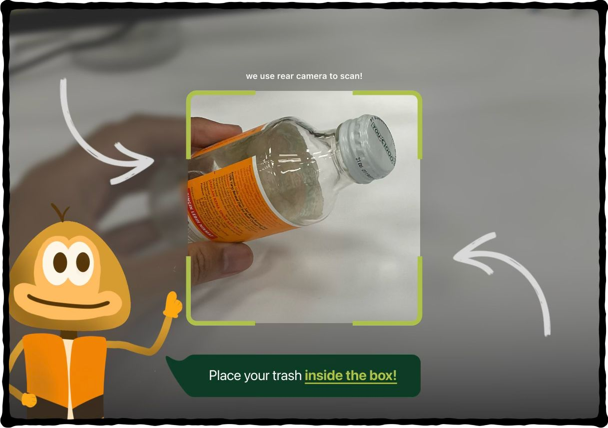
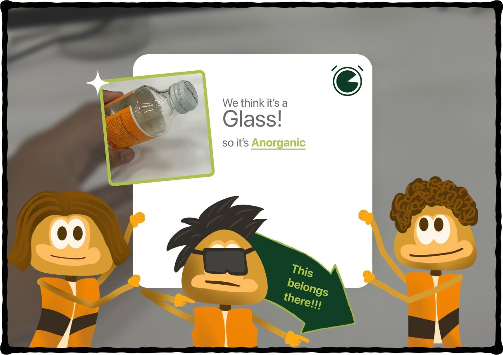

# 🗑️ BinGo — Smart Waste Classifier

**BinGo** is a machine learning-powered iPad application that helps users classify waste items in real-time using image recognition. Built using **Swift**, **SwiftUI**, and the **MVVM architecture**, this app is designed for quick waste scanning and confident decision-making — all through a seamless, offline experience.

## 💡 Project Overview

BinGo was developed to address a common issue: many people are still unsure about how to categorize their trash — *Is this item organic or anorganic?* By leveraging **image classification via machine learning**, BinGo allows users to simply scan → know → toss.

### Why Machine Learning?

Because the problem is inherently visual — recognizing and classifying different types of waste requires understanding their **appearance**, not just labels. That's where ML shines.

> “The user input is an image from a camera — ML with CreateML fits perfectly.”

---

## 🧠 Features

- 📷 Scan waste items using your camera
- 🧠 Real-time classification using trained ML model
- 🗂️ Categorize waste into Organic, Anorganic, etc.
- 💬 Simple user interface designed for clarity and speed
- 🧹 Powered by MVVM and SwiftLint for clean code
- 📡 Works offline — no server dependency

---

## 🏗️ Tech Stack

| Area         | Technology                        |
|--------------|------------------------------------|
| Language     | Swift                              |
| Framework    | SwiftUI                            |
| Architecture | MVVM (Model-View-ViewModel)        |
| ML Model     | Trained using CreateML             |
| Datasets     | TrashNet by Feyza Ozkefe (Kaggle) + RealWaste by Joakim Arvidsson (Kaggle) |
| Linting Tool | SwiftLint                          |

---

## 🧩 App Architecture

The project follows **MVVM architecture** for separation of concerns:

- **Model**: Defines data structure and interacts with the `.mlmodel` results
- **ViewModel**: Handles business logic, processes ML predictions, updates UI states
- **View**: SwiftUI components with reactive bindings to ViewModel

Additional utilities and views are modularized to promote code reusability and maintainability.

---

## 🧪 Machine Learning Integration

The ML model was trained using Apple’s **CreateML**, using a custom dataset:

- 🗃️ **TrashNet**: Base dataset with common waste categories
- 🗃️ **RealWaste**: Extended dataset for real-world photos

The `.mlmodel` file is bundled into the app and runs fully **on-device**, ensuring privacy and performance.

---

## 📱 UI

---

## 👥 Team Behind BinGo

- **PM: Amelia Morencia Irena**
- **Design: Aldrian Wicaksono, Timothy Putra**
- **Tech: Daven Karim, Samuel Dwi Putra**

Apple Developer Academy @ BINUS

---

*BinGo was created as a practical solution to promote sustainability through smarter and more confident waste disposal — with a touch of ML. ♻️*
